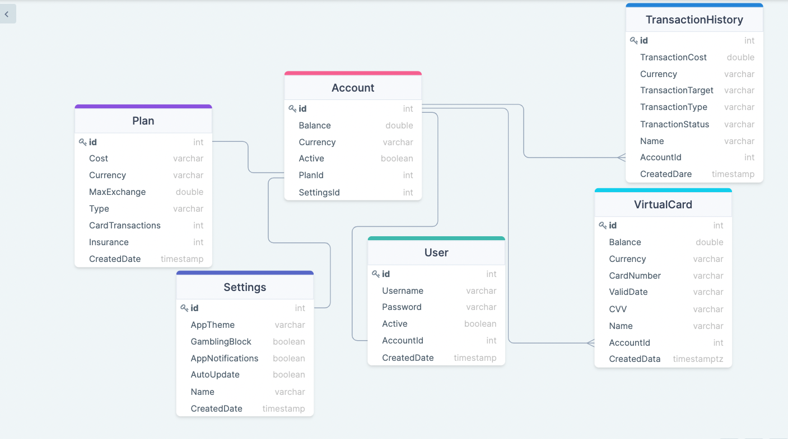

# iCard Api Clone
This project represents clone of back end of iCard application. It will be used to serve for development of mobile apps with Flutter and React Native later on.
Also this project uses GitHub Actions for CI. The project supports swagger and it shows the api endpoints.
 

# Database Schema

# Web Clients

### React
 
- Working in progress. Will be linked the repositories later
---

### Angular

-  Working in progress. Will be linked the repositories later

---

# Swagger 

Api endpoints/documentation

